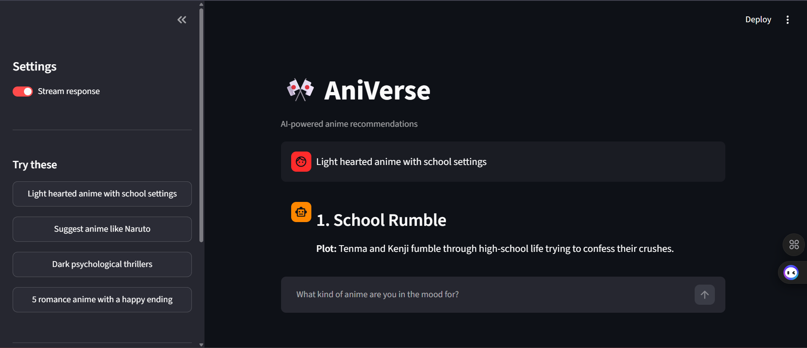
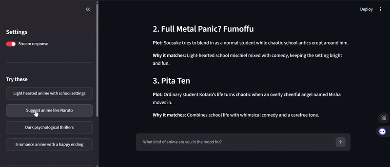

# AniVerse AI

> Describe your vibe. Find your next anime.

AniVerse AI is an AI-powered anime recommendation system that understands natural-language preferences and recommends anime using semantic search, vector retrieval, and LLM-powered generation.



## Demo


## Tech Stack

- Python
- Streamlit
- LangChain
- Hugging Face / Sentence Transformers
- BAAI/bge-base-en-v1.5
- Qdrant
- Groq / LLM
- LangSmith

## Architecture

```text
                         USER
                           |
                           v
                    +--------------+
                    |  Streamlit   |
                    |      UI      |
                    +------+-------+
                           |
                           v
                 +-------------------+
                 | Recommendation    |
                 |    Pipeline       |
                 +---------+---------+
                           |
                           v
                 +-------------------+
                 | Hugging Face      |
                 |    Embeddings     |
                 +---------+---------+
                           |
                           v
                 +-------------------+
                 |      Qdrant       |
                 |   Vector Search   |
                 +---------+---------+
                           |
                           v
                 +-------------------+
                 | Retrieved Anime   |
                 |     Context       |
                 +---------+---------+
                           |
                           v
                 +-------------------+
                 |       LLM         |
                 |  Recommendation   |
                 +---------+---------+
                           |
                           v
                      RESPONSE
```

## How It Works

AniVerse follows a Retrieval-Augmented Generation (RAG) approach:

```text
User Query
    |
    v
Query Embedding
    |
    v
Qdrant Similarity Search
    |
    v
Relevant Anime
    |
    v
Context + Prompt
    |
    v
LLM
    |
    v
Recommendation
```

1. **User Query** — The user describes what they want to watch.
2. **Embedding** — The query is converted into a vector using `all-MiniLM-L6-v2`.
3. **Retrieval** — Qdrant finds semantically similar anime from the dataset.
4. **Context** — Relevant anime information is provided to the LLM.
5. **Generation** — The LLM generates the recommendation.
6. **Response** — The result is streamed back through Streamlit.


## Quick Start

### 1. Clone the repository

```bash
git clone <your-repo-url>
cd "AniVerse AI"
```

### 2. Create a virtual environment

```bash
python -m venv animeenv
```

Windows:

```bash
animeenv\Scripts\activate
```

Linux/macOS:

```bash
source animeenv/bin/activate
```

### 3. Install dependencies

```bash
pip install -r requirements.txt
```

### 4. Configure environment variables

Create a `.env` file from `.env.example` and add the required API keys.

```env
GROQ_API_KEY=your_api_key

LANGSMITH_TRACING=true
LANGSMITH_API_KEY=your_api_key
LANGSMITH_PROJECT=AniVerse
```

### 5. Run AniVerse

```bash
python -m streamlit run app.py
```

Open:

```text
http://localhost:8501
```

## Example Queries

```text
Recommend dark psychological anime with mind games.

I want something similar to Death Note.

Give me an emotional anime with strong character development.

I want an anime with an overpowered protagonist and insane fights.
```

## Evaluation

AniVerse uses LangSmith for tracing and evaluating the recommendation pipeline.

Evaluation focuses on:

- Recommendation relevance
- Retrieval quality
- Response quality
- Prompt performance

## Limitations

- Recommendations depend on the quality and coverage of the anime dataset.
- Semantic retrieval may not perfectly capture highly specific preferences.
- LLM-generated responses can vary depending on the model and prompt.
- Initial startup can take longer because models and vector resources need to be loaded.

## Future Improvements

- Conversation-aware recommendations
- Better personalization
- Improved retrieval and reranking
- Favorites and recommendation history
- Expanded anime dataset
- More comprehensive evaluation
- Further performance optimization

## Author

**Rishika Kaur**


---

**Describe your vibe. Find your next anime.**